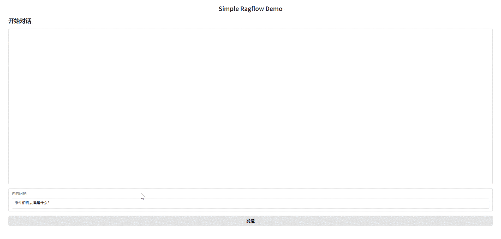

# Simple Ragflow

基于gradio的极简 ragflow API 聊天Web界面。




## 功能特性
- 基于ragflow API的实现调用知识库的对话功能
- 支持流式响应显示
- 简洁的Web界面

## 快速开始

1. 安装依赖
```bash
pip install -r requirements.txt
```

2. 启动ragflow服务
参考ragflow文档，启动ragflow系统。

3. 获取API Key
在ragflow系统中的API菜单，获取API Key。

4. 创建助理
从url中获取dialogid。

5. 修改`config.json`文件
将model、API Key、dialogid填入

6. 运行
```bash
python app.py
```
访问`http://127.0.0.1:7860`进入界面。